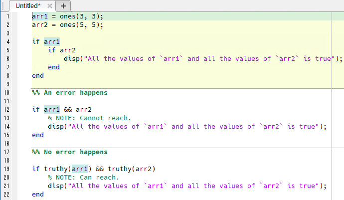

MATLAB-Truthiness
=================

[](https://github.com/botamochi0x12/matlab-truthiness/actions/workflows/ci.yml)

[](https://jp.mathworks.com/matlabcentral/fileexchange/119863-matlab-truthiness)

*MATLAB-Truthiness* extends the if-statement in MATLAB®.

<!-- TODO: Add an usage example. -->

|  op   |  self     |   input   |   output  |
|-------|-----------|-----------|-----------|
| `and` | Falsy(x)  | (ignored) | Falsy(x)  |
| `and` | Truthy(x) | Falsy(y)  | Falsy(y)  |
| `and` | Truthy(x) | Truthy(y) | Truthy(y) |
| `or`  | Falsy(x)  | Falsy(y)  | Falsy(y)  |
| `or`  | Falsy(x)  | Truthy(y) | Truthy(y) |
| `or`  | Truthy(x) | (ignored) | Truthy(x) |
| `xor` | Falsy(x)  | Falsy(y)  | False     |
| `xor` | Falsy(x)  | Truthy(y) | True      |
| `xor` | Truthy(x) | Falsy(y)  | True      |
| `xor` | Truthy(x) | Truthy(y) | False     |

:memo: Compare to: <https://doc.rust-lang.org/std/option/#boolean-operators>

Usage Examples
--------------

This section describes several exaples for the usage of the add-on *MATLAB-Truthiness*.

Most of the functionarities of the `truthy` function
can be confirmed by running each of the following examples as a MATLAB script
like the following image.



<!-- TODO: Write what the truthiness and falseiness are. -->

The MATLAB's if-statement accepts a N-dimensional array that is evaluatable as either true or false.
In contrast, the short-circuit evaluation in MATLAB such as `&&` and `||` only accepts a scalar true or false.

```matlab
arr1 = ones(3, 3);
arr2 = ones(5, 5);

if arr1
    if arr2
        disp("All the values of `arr1` and all the values of `arr2` is true");
    end
end

%% An error happens

if arr1 && arr2
    % NOTE: Cannot reach.
    disp("All the values of `arr1` and all the values of `arr2` is true");
end

%% No error happens

if truthy(arr1) && truthy(arr2)
    % NOTE: Can reach.
    disp("All the values of `arr1` and all the values of `arr2` is true");
end
```

The class `Truthiness` supports the operation "and", "or" and "xor".

```matlab
%% Operation `AND`
assert((truthy(true)  & true ) == true);
assert((truthy(true)  & false) == false);
assert((truthy(false) & true ) == false);
assert((truthy(false) & false) == false);

%% Operation `OR`
assert((truthy(true)  | true ) == true);
assert((truthy(true)  | false) == true);
assert((truthy(false) | true ) == true);
assert((truthy(false) | false) == false);

%% Operation `XOR`
assert((truthy(true) .xor(true) ) == false);
assert((truthy(true) .xor(false)) == true);
assert((truthy(false).xor(true) ) == true);
assert((truthy(false).xor(false)) == false);
```

The class `Truthiness` supports lazy evaluation.

```matlab
%% Lazy Evaluation
% NOTE: Run the below lines as a code section.

startSecs = tic;
[~] = truthy(true).orElse(@waitForOneSec);
toc(startSecs);
disp('It SHOULD NOT take 1 sec.');

function retval = waitForOneSec(~)
    pause(1);
    retval = true;
end
```

You can take a look of more examples at [`truthinessTest`](./truthinessTest.m).

Installation
------------

With git (and GitHub)::

1. Open the MATLAB directory or the directory you want to store "MATLAB-truthiness".
2. Run the command below:

    ```bash
    git clone git@github.com:botamochi0x12/MATLAB-Truthiness
    ```

3. In MATLAB command pallet, run `addpath MATLAB-Truthiness`.

With MATLAB exchange::

1. Access [the page in MATLAB File Exchange](https://jp.mathworks.com/matlabcentral/fileexchange/119863-matlab-truthiness).
2. Click "Download".

With Add-on Directory in MATLAB console::

:TODO: To be written.

Enabling the shorthand `tr`
---------------------------

This project provides a concise shorthand function `tr` as an alias for `truthy`. To avoid surprising changes to a user's MATLAB path or accidental name collisions, the `tr` shorthand is opt-in and can be enabled or disabled with the included `setup` helper.

Ways to enable `tr` (priority order used by `setup`):

- Explicit argument (highest priority):

```matlab
% Positional boolean (backwards compatible)
setup(true)          % enable `tr`
setup(false)         % disable `tr`

% Name-value pair (preferred for clarity)
setup('enableTr', true)
setup('enableTr', false)
```

- Environment variable (temporary, session-level):

Set the environment variable `MATLAB_TR` to `1`, `true`, or `on` before starting MATLAB or in the environment where MATLAB is launched. Example for `fish` shell:

```fish
set -x MATLAB_TR 1
# then start MATLAB or run setup() inside MATLAB
```

- Project-level flag file (persistent for the repository):

Create an empty file named `.tr_enabled` at the project root to make `setup()` enable `tr` by default for that working copy:

```bash
touch .tr_enabled
```

How `setup()` decides
---------------------

When called with no arguments, `setup()` determines whether to enable `tr` using the following priority:

1. If a positional boolean or the name-value `enableTr` argument is provided, use it.
2. Otherwise, if the environment variable `MATLAB_TR` is set to `1`, `true`, or `on`, enable.
3. Otherwise, if the repository contains a `.tr_enabled` file, enable.
4. Otherwise, default to disabled.

Notes and best practices
------------------------

- Because `addpath` / `rmpath` are used to expose or hide the shorthand, be aware of possible name collisions with other `tr` functions on your MATLAB path. `setup(true)` will warn if multiple `tr` definitions are found on the path.
- For continuous integration or automated scripts, prefer `setup(true)` or setting `MATLAB_TR=1` at the environment level before running MATLAB.
- If you prefer the library to always expose `tr` without using `setup`, you can add the project root to your MATLAB path permanently (for example using `addpath` in your startup script), but that removes the opt-in safety.


Bug Report and Contribution
---------------------------

Anyone accepting [CODE_OF_CONDUCT](./.github/CODE_OF_CONDUCT.md) can contribute to this project,
or anyone who found any bugs can submit a report about them to this project.

Feel free to submit your ["pull requests" :twisted_rightwards_arrows:](https://github.com/botamochi0x12/matlab-truthiness/pulls) or your ["issues" :speech_balloon:](https://github.com/botamochi0x12/matlab-truthiness/issues).

LICENSE
-------

See [LICENSE](./LICENSE).
